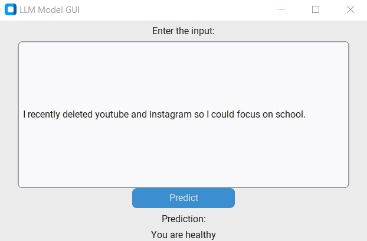
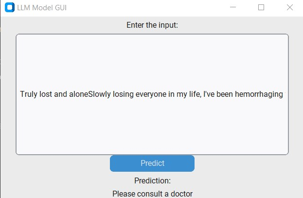

Project: Depression Detection by Hackathon Brothers and Sisters
===============================================================

Overview
--------

Our team at Hackathon Brothers and Sisters presents a powerful tool for detecting depression from textual content. Leveraging a sophisticated BERT model, our solution achieves remarkable accuracy scores:

*   Accuracy: 97.65%
*   F1 Score: 97.63%
*   Recall: 97.05%
*   Precision: 98.22%

While currently capable of binary detection, our roadmap includes advancing it into a multi-class classification task ranging from 1 to 5 severity levels.

Examples
---------

**Example 1:**

Input: "Social Media I recently deleted youtube and instagram so I could focus on school. I have promptly shifted that time to reddit. Should I delete reddit?"

**Example 2:**

Input: "Truly lost and aloneSlowly losing everyone in my life, I've been hemorrhaging friends and family for the past 6 years I'd say.\n\nThe only person in my family that still has any emotion for me is my aunty who I rarely even see anymore. I have next to no friends that I see anymore and even when I do I can tell they're itching to leave."

Key Features
------------

*   **Intuitive GUI**: Interact effortlessly with our user-friendly Graphical User Interface.
*   **Precise Detection**: Utilizing state-of-the-art BERT model for accurate depression detection.
*   **High Accuracy**: Our solution guarantees robust performance with high precision and recall.

Installation Guide
------------------

1.  **Clone Repository**: `git clone https://github.com/maxmelichov/Hackathon-brothers-and-sisters`
2.  **Setup Virtual Environment**: We recommend creating a virtual environment for seamless dependency management: `python -m venv venv`
3.  **Install Dependencies**: Execute `pip install -r requirements.txt` to install the necessary packages.

Datasets Used
-------------

*   [Depression Reddit (Cleaned)](https://www.kaggle.com/datasets/infamouscoder/depression-reddit-cleaned)
*   [Suicide Watch](https://www.kaggle.com/datasets/nikhileswarkomati/suicide-watch)

Training Process
----------------

1.  **Download Datasets**: Obtain the datasets from the provided links.
2.  **Data Preparation**: Place the CSV files into a folder named `data`.
3.  **Environment Setup**: Activate the virtual environment.
4.  **Run Training Script**: Execute `set CUDA_VISIBLE_DEVICES=0 & python preprocess_and_train.py` in the project directory.

GUI Usage
---------

1.  **Launch Application**: Run `GUI.py` to initiate the Graphical User Interface.
2.  **Input Text**: Enter the text to be analyzed for indications of depression.
3.  **Instant Results**: Receive immediate feedback on the presence of depressive tendencies in the text.

Contributing
------------

We welcome contributions from the community! Follow these steps to contribute:

1.  **Fork Repository**: Fork the repository to your GitHub account.
2.  **Create Branch**: Create a new branch for your feature: `git checkout -b feature/your-feature`
3.  **Implement Changes**: Make your desired changes and commit them: `git commit -m 'Add your feature'`
4.  **Push Changes**: Push your changes to the branch: `git push origin feature/your-feature`
5.  **Submit Pull Request**: Submit a pull request for review and collaboration.

Contact Us
----------

For questions, suggestions, or collaboration opportunities, feel free to reach out to us at maxme006@gmail.com. We highly value your feedback and engagement!

* * *

Feel free to tweak any details to better fit your project's style and requirements!